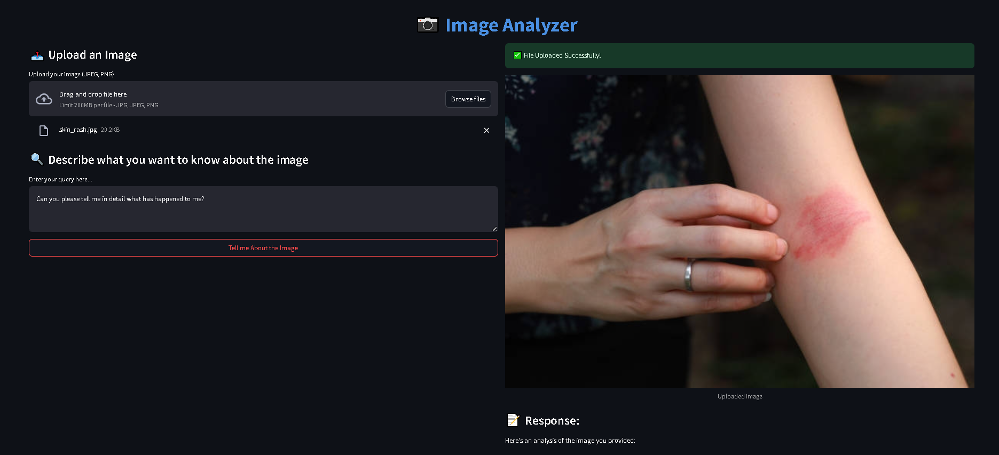

# Image Analyzer



## Overview
The **Image Analyzer** is a Streamlit-based application that leverages Google's Gemini AI to analyze images based on user queries. Users can upload an image and input a description of what they want to know about it. The application then processes the image and generates a response using the Gemini AI model.

## Features
- 📤 **Image Upload**: Supports JPEG and PNG formats.
- 🔍 **User Queries**: Allows users to describe what they want to analyze in the image.
- 🤖 **AI-Powered Analysis**: Utilizes Google Gemini AI for intelligent image interpretation.
- 🖼️ **Preview Uploaded Image**: Displays the uploaded image for user reference.
- ⏳ **Real-Time Processing**: Provides quick insights with a seamless user experience.

## Installation

### Prerequisites
Ensure you have the following installed:
- Python 3.x
- Streamlit
- Google Generative AI SDK
- dotenv
- Pillow

### Setup
1. Clone this repository:
   ```sh
   git clone https://github.com/PriyanshuDey23/Image-Analyzer-using-Generative-AI.git
   cd image-analyzer
   ```
2. Create a virtual environment (optional but recommended):
   ```sh
   python -m venv venv
   source venv/bin/activate  # On Windows use `venv\Scripts\activate`
   ```
3. Install dependencies:
   ```sh
   pip install -r requirements.txt
   ```
4. Set up the environment variables:
   - Create a `.env` file in the project root.
   - Add your Google API key:
     ```
     GOOGLE_API_KEY=your_google_api_key
     ```

## Usage
Run the Streamlit app:
```sh
streamlit run app.py
```

### How to Use
1. Upload an image (JPEG/PNG).
2. Enter a description of what you want to analyze in the image.
3. Click the **"Tell me About the Image"** button.
4. View the AI-generated response.

## Project Structure
```
image-analyzer/
│── app.py               # Main Streamlit application
│── prompt.py            # Contains AI prompt logic
│── requirements.txt      # Dependencies
│── .env                 # API key storage (not included in repo)
```

## Dependencies
- `streamlit`
- `google-generativeai`
- `python-dotenv`
- `pillow`

## License
This project is licensed under the MIT License.

## Author
[Your Name](https://github.com/your-github-profile)